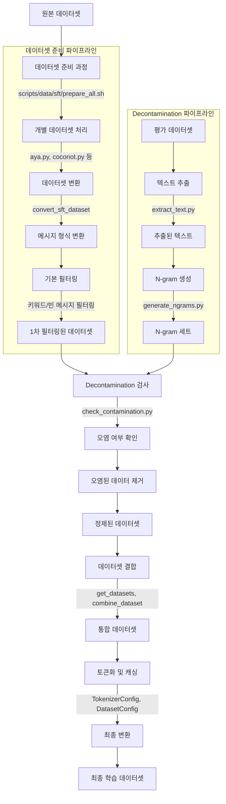
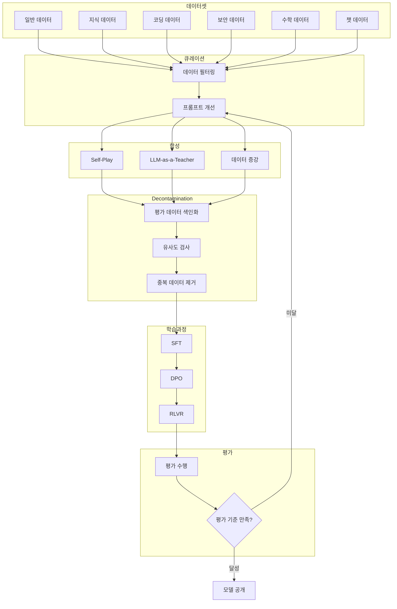

# Tulu3 학습 데이터 분석 및 과정

## 1. 개요

Tulu3는 다양한 데이터셋을 활용하여 학습된 대규모 언어 모델입니다. 이 문서에서는 Tulu3의 학습 데이터 수집, 처리, 그리고 학습 과정에 대해 상세히 설명합니다.

## 2. 학습 데이터 수집 및 구성

Tulu3의 학습 데이터는 크게 두 가지 출처에서 수집되었습니다:

### 2.1 오픈 소스 데이터 (57%)

- **목적**: 다양한 사용자 요청을 일반화하여 처리할 수 있는 능력 향상
- **수집 과정**:
  - 공개적으로 이용 가능한 데이터셋 광범위 조사
  - 전문가 주석 데이터, 실제 사용자 제공 데이터, 합성 데이터 포함
  - 사람이 직접 리뷰하여 엄격한 선별 과정 진행

- **주요 데이터셋**:
  #### 1. 일반 (General)
  - **OpenAssistant Guanaco**: 7,132개 프롬프트 (SFT, DPO 모두 사용)
    - Kopf et al. [2024]
    - 개요: OpenAssistant 프로젝트의 일환으로 수집된 대화형 데이터로, 다양한 언어와 주제를 포함하여 AI 모델의 대화 능력을 향상시키는 데 사용됩니다.
    - 특징:
      - 다양한 언어 지원: 영어를 포함한 여러 언어로 구성되어 다국어 환경에서의 모델 학습에 유용
      - 고품질 대화 데이터: 실제 사람들의 대화를 기반으로 자연스러운 대화 흐름 학습
      - 활용: SFT와 DPO에 활용되어 대화 및 지시 수행 능력 향상
  - **TÜLU 3 Hardcoded**: 모델에 직접 코딩된 특수 프롬프트 (24개)
  - **No Robots**: 9,500개 프롬프트 (SFT, DPO 모두 사용)
    - Rajani et al. [2023]
    - 개요: 숙련된 인간 주석자들이 작성한 10,000개의 지시문과 데모로 구성된 고품질 데이터셋
    - 특징:
      - 다양한 작업 범주: 생성, QA, 브레인스토밍, 채팅, 재작성, 요약, 코딩 등 10개 카테고리
      - 인간 작성 데이터: GPT 모델이 아닌 인간 주석자가 작성하여 데이터의 다양성과 품질 보장
      - 활용: 언어 모델의 지시 이해 및 수행 능력 향상을 위한 지도 미세 조정에 사용
  - **WildChat GPT-4**: 241,307개 중 100,000개 사용
  - **Evol CodeAlpaca**: 107,276개 프롬프트

  #### 2. 지식 회상 (Knowledge Recall)
  - **FLAN v2**: 89,982개 프롬프트
  - **SciRIFF**: 과학적 정보 관련 35,357개 프롬프트
  - **TableGPT**: 표 데이터 기반 5,000개 프롬프트

  #### 3. 수학 및 추론 (Math & Reasoning)
  - **TÜLU 3 Persona MATH**: 페르소나 기반으로 합성된 수학 문제 149,960개
  - **TÜLU 3 Persona GSM**: GSM(GSM8K 등)의 형태를 띤 합성 데이터 49,980개
  - **TÜLU 3 Persona Algebra**: 대수학 분야의 합성 프롬프트 20,000개
  - **OpenMathInstruct**: 수학 교육 목적의 오픈 데이터셋 50,000개
  - **NuminaMath-TIR**: 수학적 추론 관련 데이터 34,439개

### 2.1.1 No Robots 데이터셋 구조 및 예시

#### 데이터 구조
- **prompt**: 사용자의 요청이나 질문을 나타내는 프롬프트 텍스트
- **messages**: 모델이 실제로 학습하는 대화 쌍(사용자 요청과 모델 응답)
- **category**: 프롬프트의 유형이나 목적을 나타내는 범주

#### 예시 데이터
| prompt                                                 | messages                                                                                                                                                                                              | category   |
| ------------------------------------------------------ | ----------------------------------------------------------------------------------------------------------------------------------------------------------------------------------------------------- | ---------- |
| 케이크를 구우려고 하는데, 어떤 맛이 좋을지 추천해줄래? | ('케이크를 구우려고 하는데, 어떤 맛이 좋을지 추천해줄래?', '물론이죠! 다음과 같은 다양한 맛을 추천드립니다:\n1. 레몬 블루베리\n2. 초콜릿 오렌지\n3. 바닐라 라즈베리\n4. 당근 크림치즈\n5. 녹차 말차') | Brainstorm |
| 이 제품 리뷰를 읽기 쉽고 짧은 문장으로 다시 써줘.      | ('이 제품 리뷰를 읽기 쉽고 짧은 문장으로 다시 써줘.', '다음은 이해하기 쉽도록 다시 쓴 리뷰입니다:\n- 제품이 튼튼하고 오래 갑니다.\n- 가격도 적당하고 품질이 좋아요.\n- 배송도 빨라서 좋았습니다.')    | Rewrite    |

#### 데이터 카테고리
- **Brainstorm**: 창의적인 아이디어 생성 및 제안
- **Rewrite**: 기존의 내용을 다른 방식으로 재구성하거나 단순화하여 표현

#### Messages의 역할
- 모델이 실제로 학습하는 '정답지' 역할
- 사용자의 요청과 이에 대한 이상적인 응답이 쌍으로 구성
- 모델이 적절하고 자연스러운 응답을 생성하는 방법을 학습하는 데 활용

### 2.2 합성 데이터 (43%)

- **목적**: 기존 공개 데이터로 부족한 특정 기술 영역 보완
- **방법론**: 페르소나(Persona) 기반 데이터 합성
  - 특정 관점에서 데이터를 합성하도록 모델 유도
  - 예: "신경망을 연구하는 머신러닝 연구자" 페르소나로 코딩 문제 생성

- **주요 합성 데이터셋**:
  - **Tulu 3 Persona MATH**: 수학 문제 149,960개
  - **Tulu 3 Persona GSM**: GSM 형태 합성 데이터 49,980개
  - **Tulu 3 Persona Algebra**: 대수학 분야 20,000개
  - **OpenMathInstruct**: 수학 교육 목적 50,000개
  - **NuminaMath-TIR**: 수학적 추론 34,439개
  - **Tulu 3 Hardcoded**: 모델에 직접 코딩된 특수 프롬프트 24개

### 2.3 전체 데이터셋 규모

- **총 939,344개의 프롬프트** 수집
- 일반(General), 지식 회상(Knowledge Recall), 수학 및 추론(Math & Reasoning) 등 핵심 기술에 중점

## 3. 프롬프트 큐레이션 (Prompt Curation)

### 3.1 프롬프트 큐레이션의 개념

- 기존 데이터셋에서 품질이 높은 프롬프트를 선별하여 모델이 효율적으로 학습하도록 함
- 불필요한 데이터(단순하거나 반복적인 데이터)를 제거하여 학습 효율성 향상

### 3.2 프롬프트 큐레이션 과정

#### 데이터 필터링 및 정제
- **단순하거나 불필요한 프롬프트** (예: "2+2는?") 삭제
- **중복 데이터** 및 **비효율적 질문** 제거

#### 프롬프트 개선 및 보강
- 단순한 질문을 **추론적이고 논리적인 사고가 필요한 형태**로 변경

- **예시**:
  - 변경 전: "2+2는 얼마인가요?" (단순 계산형 질문)
  - 변경 후: "사과를 2개 가지고 있는데, 2개를 더 샀다면 사과는 총 몇 개인가요? 답을 설명해 주세요." (추론과 설명이 요구되는 질문)

## 4. 프롬프트 합성 (Prompt Synthesis)

### 4.1 프롬프트 합성의 개념

- 새로운 프롬프트를 인공적으로 생성하는 과정
- 기존 데이터에서 좋은 질문을 고르는 큐레이션과 달리, 완전히 새로운 질문을 만드는 작업

### 4.2 프롬프트 합성 기법

#### 페르소나 기반(persona-driven)
- 특정 역할이나 관점(페르소나)을 설정하여, 해당 관점에서의 질문과 응답 데이터를 생성
- **예시**:
  - 고등학교 수학 교사
  - 파이썬 개발자
  - 금융 전문가

#### Self-Play & Bootstrapping
- AI가 스스로 질문을 만들고 답을 생성하여 데이터 확장
- 모델이 질문을 스스로 확장하며 자연스럽고 창의적인 데이터 생성
- **예시**:
  - 원본 질문: "광합성이란 무엇인가?"
  - AI 생성 질문: "지구상에서 광합성이 멈추면 어떤 일이 벌어질까?"

#### LLM-as-a-Teacher (대형 언어모델 활용)
- 기존 고성능 모델(예: GPT-4)을 활용하여 고품질 합성 프롬프트 생성
- 기존 프롬프트의 변형이나 새로운 관련 질문 생성
- **예시**:
  - GPT-4 활용: "광합성 과정을 설명해줘." → "식물에서 일어나는 광합성의 화학적 과정을 자세히 설명해줘."

#### 데이터 증강 및 변형 (Augmentation & Variation)
- 기존 질문을 재구성하거나 다양한 방식으로 변형
- 모델이 비슷하지만 다양한 표현과 방식에 대응하도록 학습
- **예시**:
  - 원본: "광합성 작용에 대해 설명하라."
  - 변형: "광합성의 화학적 과정에 대해 서술하시오."

### 4.3 페르소나 기반 합성 예시

#### 수학 추론 문제 합성 (페르소나: 고등학교 수학 교사)
- **프롬프트**: "두 정수가 있습니다. 두 정수의 곱은 -12이며 합은 1입니다. 두 정수를 찾고 풀이 과정을 설명하세요."
- **합성 응답**: 
  ```
  두 정수를 x, y라고 할 때, xy = -12이고, x+y = 1입니다.
  두 수는 4와 -3이며, 곱하면 -12이고 합하면 1입니다.
  ```

#### 프로그래밍 관련 합성 (페르소나: 파이썬 개발자)
- **프롬프트**: "파이썬으로 재귀 함수를 이용해 팩토리얼(factorial)을 구현하는 예제를 작성하세요."
- **합성 응답**:
  ```python
  def factorial(n):
      if n == 0:
          return 1
      else:
          return n * factorial(n - 1)
  
  print(factorial(5))  # 출력: 120
  ```

### 4.4 프롬프트 합성의 중요성
프롬프트 합성은 다음과 같은 중요한 역할을 합니다:

- 모델이 특정 분야의 전문적 지식과 기술을 효과적으로 학습할 수 있도록 도와줍니다
- 기존 공개 데이터셋에서 부족했던 **다양한 페르소나와 관점**을 모델에 학습시킬 수 있습니다
- 이를 통해 모델은 다양한 사용자의 요구사항에 대해 더욱 정확하고 만족도 높은 응답을 생성할 수 있게 됩니다


## 5. Decontamination (데이터 비오염화)

### 5.1 Decontamination의 개념

- 모델이 평가 데이터(Test Set)를 미리 학습하는 문제를 방지하기 위한 과정
- 학습 데이터(Training Set)에서 평가 데이터와 겹치는 부분을 제거

### 5.2 Decontamination 과정

#### 평가 데이터 전처리
- 평가 데이터(test set)를 문장 단위로 분리하여 분석 가능한 형태로 준비
- 데이터 정규화 및 표준화 작업 수행

#### 학습 데이터와 평가 데이터 간 유사성 검사
- 유사도 평가 방법:
  - **N-gram 매칭**: 연속된 N개 단어 단위로 겹치는 정도 비교
  - **Cosine Similarity**: 문장 간 벡터 유사도 계산
  - **Jaccard Index**: 두 집합의 교집합 비율로 유사도 계산
  - **Dense Embeddings**: 의미적 유사도 계산

#### 중복 데이터 필터링 및 수정
- 학습 데이터가 평가 데이터와 매우 유사(90% 이상)하면 완전히 삭제
- 부분적으로 유사(60~90%)하다면, 사람이 직접 확인하고 수정

### 5.3 Decontamination 예시

#### 🚩 Before (중복 데이터가 존재하는 경우)

| 데이터 종류                     | 내용                                                            |
| ------------------------------- | --------------------------------------------------------------- |
| **평가 데이터** (유지됨)        | "Where is the Eiffel Tower?" (에펠탑은 어디에 있나요?)          |
| **학습 데이터에서 삭제할 예시** | "The Eiffel Tower is located in Paris." (에펠탑은 파리에 있다.) |

##### ❌ 이 경우의 문제점:
- 학습 데이터에 이미 **"에펠탑이 파리에 있다"** 는 정보가 그대로 들어가 있습니다.
- 모델은 학습 단계에서 이미 평가 데이터가 물어보는 정보를 직접적으로 학습한 상태가 됩니다.
- 따라서 평가 데이터의 질문에 대한 답변을 모델이 추론이나 이해 없이,  
  **단순히 기억해 두었던 내용을 그대로 꺼내서 응답(암기)** 할 위험이 생깁니다.
- 이는 모델의 실제 추론 능력을 평가할 수 없게 만들며, 성능 평가를 **왜곡**시킵니다.

#### ✅ After (Decontamination 수행 후)

| 데이터 종류               | 내용                                                                                                                                    |
| ------------------------- | --------------------------------------------------------------------------------------------------------------------------------------- |
| **평가 데이터** (유지됨)  | "Where is the Eiffel Tower?" (에펠탑은 어디에 있나요?)                                                                                  |
| **학습 데이터 수정 예시** | "The Eiffel Tower is a famous landmark in France, known for its structure." (에펠탑은 프랑스의 유명한 랜드마크이며, 구조물로 유명하다.) |

##### 💡 개선된 점:
- 평가 데이터("에펠탑의 위치는?")에서 요구하는 정확한 정보("파리")가 학습 데이터에 직접적으로 제시되지 않도록 합니다.
- 대신 학습 데이터는 보다 **간접적이고 일반적인 형태의 정보만 제공합니다**.  
  (예: 에펠탑은 프랑스의 유명한 구조물이라는 일반적 사실 제공)
- 이렇게 하면 모델은 평가 데이터 질문에 대해 **단순 암기 대신, 문맥이나 일반적인 정보에 근거하여 답을 추론**해야 합니다.

## 6. Tulu-3 SFT 데이터셋 구조 상세 설명

### 6.1 기본 데이터 구조

Hugging Face에 공개된 [allenai/tulu-3-sft-mixture](https://huggingface.co/datasets/allenai/tulu-3-sft-mixture) 데이터셋은 다음과 같은 구조로 되어 있습니다:

- **messages**: 대화 형식의 리스트로, 모델 학습에 직접 사용되는 핵심 데이터
  - **content**: 실제 텍스트 내용 (사용자 질문 또는 AI 응답)
  - **role**: 메시지 역할 ("user" 또는 "assistant")
- **id**: 각 데이터 샘플의 고유 식별자
- **source**: 데이터의 출처 데이터셋

### 6.2 데이터 예시와 분석

```
{
  "id": "고유 식별자",
  "messages": [
    {
      "content": "사용자 질문/요청",
      "role": "user"
    },
    {
      "content": "AI 응답",
      "role": "assistant"
    }
  ],
  "source": "출처 데이터셋"
}
```

**messages**: 이 필드는 대화 형식의 리스트로, 모델 학습에 직접 사용되는 핵심 데이터입니다.
   
   - **content**: 실제 텍스트 내용을 담고 있습니다. 사용자의 질문이나 AI의 응답 텍스트가 들어갑니다.
   
   - **role**: 해당 메시지의 역할을 나타냅니다. 두 가지 값이 있습니다:
     - `"user"`: 사용자가 입력한 질문이나 요청을 의미합니다. 모델이 이해하고 응답해야 할 입력입니다.
     - `"assistant"`: AI 어시스턴트의 응답을 의미합니다. 모델이 생성해야 할 이상적인 출력입니다.

**source**: 해당 데이터가 어떤 원본 데이터셋에서 왔는지 출처를 나타냅니다.

#### 6.2.1 학습 과정에서의 역할

이 데이터셋은 지도 학습 미세 조정(Supervised Fine-Tuning, SFT)에 사용됩니다:

1. 모델은 `"user"` 역할의 content를 입력으로 받습니다.
2. 모델은 `"assistant"` 역할의 content를 생성하도록 학습됩니다.
3. 학습 과정에서 모델은 "이런 질문이 들어오면 이렇게 응답해야 한다"는 패턴을 배웁니다.

### 6.2.2 실제 예시 분석

```json
{
  "id": "oasst1_5551",
  "messages": [
    {
      "content": "explain WebUSB in simple terms",
      "role": "user"
    },
    {
      "content": "WebUSB is a technology that allows web developers...",
      "role": "assistant"
    }
  ],
  "source": "ai2-adapt-dev/oasst1_converted"
}
```

- 사용자(`"user"`)가 "WebUSB를 간단한 용어로 설명해줘"라고 요청했습니다.
- 어시스턴트(`"assistant"`)는 "WebUSB는 웹 개발자가 사용할 수 있는 기술로..."라고 응답했습니다.
- 이 데이터는 "ai2-adapt-dev/oasst1_converted" 데이터셋에서 가져왔습니다.

### 6.2.3 다양한 대화 형태

Tulu-3 데이터셋은 단순한 1:1 질문-응답뿐만 아니라, 여러 턴의 대화도 포함할 수 있습니다:

```json
{
  "id": "example_multi_turn",
  "messages": [
    {"content": "파이썬으로 간단한 웹 스크래퍼를 만들고 싶어요", "role": "user"},
    {"content": "네, requests와 BeautifulSoup 라이브러리를 사용하면 쉽게 만들 수 있습니다...", "role": "assistant"},
    {"content": "그럼 이미지도 다운로드할 수 있나요?", "role": "user"},
    {"content": "네, 이미지 URL을 찾아서 다운로드하는 방법은 다음과 같습니다...", "role": "assistant"}
  ],
  "source": "some_dataset"
}
```

이런 형태의 데이터를 통해 모델은 대화의 맥락을 이해하고 이전 대화를 기억하며 응답하는 능력을 학습합니다.

## 7. 데이터셋 관련 프로젝트 구조 분석

### 7.1 데이터셋 관련 도구

#### 데이터셋 준비 도구
- **scripts/data/sft/** 디렉토리에는 다양한 데이터셋을 처리하는 스크립트가 있습니다:
  - `prepare_all.sh`: 모든 SFT(Supervised Fine-Tuning) 데이터셋을 준비하는 스크립트
  - 각 데이터셋별 처리 스크립트: `aya.py`, `coconot.py`, `lima.py`, `sharegpt.py` 등
  - 이 스크립트들은 데이터셋을 다운로드하고, 필터링하고, 메시지 형식으로 변환하는 작업을 수행합니다

#### 데이터셋 변환 및 필터링 도구
- **open_instruct/dataset_transformation.py**: 데이터셋 변환 및 필터링을 위한 함수들을 제공합니다
  - `sft_tokenize_v1`, `sft_filter_v1` 등의 함수로 데이터셋을 토큰화하고 필터링합니다
  - `DatasetConfig` 클래스를 통해 데이터셋 구성을 관리합니다

#### 데이터셋 유틸리티
- **open_instruct/utils.py**: 데이터셋 로딩, 결합, 변환을 위한 유틸리티 함수 제공
  - `get_datasets()`: 여러 데이터셋을 로드하고 결합하는 함수
  - `combine_dataset()`: 여러 데이터셋을 하나로 결합하는 함수

#### 데이터셋 필터링 도구
- **scripts/data/sft/utils.py**: 데이터셋 필터링을 위한 유틸리티 함수 제공
  - `should_be_filtered_by_keyword()`: 특정 키워드(예: "OpenAI", "ChatGPT")가 포함된 대화를 필터링
  - `should_be_filtered_by_empty_message()`: 빈 메시지가 포함된 대화를 필터링
  - `convert_sft_dataset()`: 데이터셋을 SFT 형식으로 변환하는 함수

#### 선호도 데이터셋 도구
- **scripts/data/preferences/**: 선호도 데이터셋을 처리하는 스크립트들
  - `helpsteer2.py`, `nectar.py` 등 다양한 선호도 데이터셋을 처리하는 스크립트
  - 이 스크립트들은 선호도 데이터를 이진화하고 처리하는 기능을 제공합니다

### 7.2 프롬프트 합성 도구

#### 합성 선호도 파이프라인
- **scripts/synth_pref/**: 합성 선호도 데이터 생성을 위한 파이프라인
  - `generate_responses.py`: 모델 응답 생성
  - `create_annotation_mix.py`: 응답 혼합 생성
  - `annotate_preferences.py`: 선호도 주석 생성
  - `parse_preferences.py`: 선호도 데이터 파싱

#### 페르소나 기반 데이터 생성
- **scripts/persona_driven_data_gen/**: 페르소나 기반 데이터 생성 도구
  - `prompt_templates.py`: 다양한 페르소나 기반 프롬프트 템플릿 제공
  - `persona_driven_generate_ifdata.py`: 명령어 따르기 데이터 생성
  - `persona_driven_generate_math_code.py`: 수학 및 코드 문제/해결책 생성

### 7.3 Decontamination 

- **decontamination/**: 훈련-평가 데이터 중복 측정 도구
  - `index.py`: 훈련 데이터셋을 Elasticsearch 인덱스로 변환
  - `search.py`: 테스트 데이터로 인덱스를 검색하여 중복 측정
  - 텍스트 매칭과 벡터 기반 매칭을 모두 지원합니다
  - 기능
    - 훈련 데이터셋을 텍스트 또는 벡터로 인덱싱
    - n-gram 매칭 또는 임베딩 기반 유사도 검색
    - 데이터 제거 및 정제된 데이터셋 생성
    - 보고서 생성
  
### 7.4 사용 방법 요약

#### 데이터셋 준비
```bash
# 모든 SFT 데이터셋 준비
bash scripts/data/sft/prepare_all.sh

# 특정 데이터셋 준비 (예: ShareGPT)
python -m scripts.data.sft.sharegpt --push_to_hub --hf_entity ai2-adapt-dev --apply_keyword_filters --apply_empty_message_filters
```

#### 페르소나 기반 데이터 생성
```bash
# 명령어 따르기 프롬프트 생성
python persona_driven_generate_ifdata.py --model "gpt-4o" --start_index 0 --end_index 1000 --output_path if_prompts.jsonl --dataset ai2-adapt-dev/personahub_personas --template instruction_following

# 수학 문제 생성
python persona_driven_generate_math_code.py --model "gpt-4o" --end_index 1000 --output_path math_problems.jsonl --dataset ai2-adapt-dev/personahub_personas --template math
```

#### 합성 선호도 데이터 생성
```bash
# 응답 생성 설정
python -m scripts.synth_pref.generate_responses --name myprompts --source_file "example/*.jsonl" --target_dir "output/"

# 주석 혼합 생성
python -m scripts.synth_pref.create_annotation_mix --name myprompts --input_dir output/ --output_dir annotation_mix/ --prompt_template ultrafeedback
```

#### Decontamination
```bash
# 훈련 데이터셋 인덱싱
python index.py --dataset HF_DATASET_NAME

# 오염 검사
python search.py --train_dataset_names TRAIN_DATASET_NAME --dataset TEST_DATASET_NAME --output_dir /path/to/output

# 데이터셋 정제
python search.py --train_dataset_names TRAIN_DATASET_NAME --dataset TEST_DATASET_NAME --output_dir /path/to/output --decontaminate
```

## 8. 학습 데이터셋 생성



## 9. 결론

Tulu3의 학습 데이터 준비 과정은 다양한 출처의 데이터를 수집하고, 철저한 큐레이션과 합성, 그리고 Decontamination을 통해 고품질의 학습 데이터를 구축하는 과정입니다. 이러한 과정을 통해 Tulu3는 다양한 작업에서 높은 성능을 발휘할 수 있게 되었습니다.

데이터 준비 과정에서 특히 주목할 만한 것은 프롬프트 큐레이션과 합성 전략입니다. 프롬프트 큐레이션을 통해 기존 데이터에서 양질의 질문들을 선별했을 뿐만 아니라, 프롬프트 합성을 통해 완전히 새로운 질문들을 추가로 생성하여 학습 데이터셋을 한층 더 풍부하게 만들었습니다.

또한 페르소나 기반 데이터 합성 방법론은 특정 분야의 전문적 지식과 기술을 모델에 효과적으로 학습시키는 데 큰 역할을 했으며, 철저한 Decontamination 과정은 모델의 평가 결과가 실제 성능을 정확히 반영하도록 보장했습니다. 이러한 종합적인 데이터 준비 과정을 통해 Tulu3는 보다 풍부하고 질 높은 학습 데이터를 확보할 수 있었습니다.

## 10. Tulu3 Model Pipeline



## 부록

### Parquet 파일 형식
- 확장자: `.parquet`
- 특징:
  - 열(column) 기반의 데이터 저장 방식
  - 높은 압축률과 빠른 읽기 속도 제공
  - 빅데이터 처리와 분석 작업에 최적화
