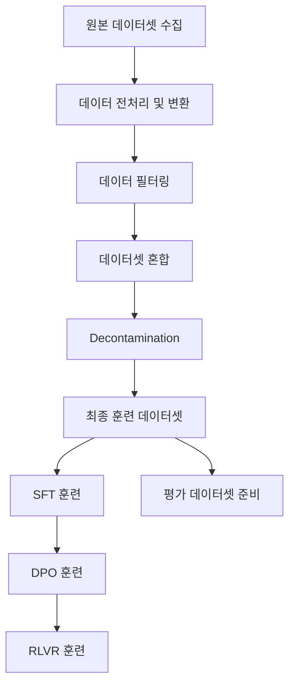
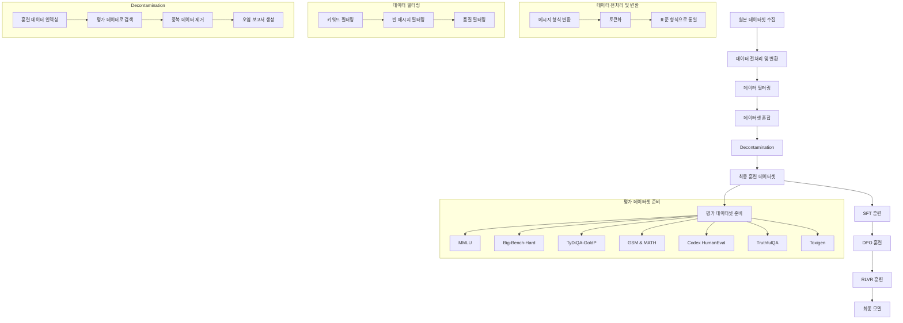

Tulu3 

# 학습 데이터
- 프롬프트 데이터 수집과 생성 과정

1. 오픈 소스 데이터(Open Source Data)
목적:

모델이 다양한 사용자의 요청을 일반화하여 잘 처리할 수 있도록 폭넓은 데이터 수집이 목적입니다.
과정:

공개적으로 이용 가능한 데이터셋을 광범위하게 조사합니다.
전문 작업자들이 주석을 단 데이터, 실제 사용자들이 제공한 데이터, 다른 모델을 통해 합성된 데이터까지 포함합니다.
각각의 데이터셋은 사람이 직접 리뷰하여 아래 기준에 따라 엄격히 선별합니다.
선별 기준:

다양성: 모델의 일반화 능력을 향상하기 위해 다양한 분야와 스타일을 포함.
도전적 기술 포함 여부: 복잡한 추론, 코딩, 정확한 지시사항 처리 같은 난이도 높은 기술을 다루는 데이터를 우선 선택.
명확한 출처와 라이선스: 데이터의 출처와 사용 권한이 명확하고 정확한 경우에만 포함.
데이터 오염 방지: 평가 데이터와 2% 이상 겹치는 학습 데이터를 철저히 제거하여 평가의 공정성 유지.

2. 합성 데이터 생성(Synthetic Data Curation)
목적:

기존 공개 데이터만으로는 부족한 특정 기술 영역을 보완하고자 합성 데이터를 자체적으로 생성합니다.
방법론(Chan et al. 2024):

다양한 **페르소나(Persona)**를 설정하여 특정한 관점에서 데이터를 합성하도록 모델을 유도합니다.
예시: 페르소나 = "신경망을 연구하는 머신러닝 연구자"
프롬프트 = "코딩 문제를 생성하시오."
이를 통해 수학 문제, 코딩 문제, 명확한 지시사항 처리 능력 등을 훈련하는 데 필요한 데이터를 맞춤형으로 생성합니다.

최종적으로 수집한 데이터의 규모:
전체 939,344개의 프롬프트를 수집하여 Tülu 3 모델의 학습에 사용했습니다.
이 중 57%는 공개 데이터에서, 나머지 43%는 자체적으로 합성한 데이터로 구성되었습니다.

-----------
# 프롬프트 데이터셋의 상세한 구성

- 데이터는 크게 General (일반), Knowledge Recall (지식 회상), **Math & Reasoning (수학 및 추론)**의 세 가지 카테고리로 분류됩니다.

각 카테고리별로 주요 데이터셋을 살펴보면 다음과 같습니다.

일반적인 대화 및 지시 수행과 관련된 데이터로, 폭넓은 지식과 범용적인 능력을 학습하는 데 사용됩니다.

---

### 1. 일반 (General)
일반적인 대화 및 지시 수행과 관련된 데이터로, 폭넓은 지식과 범용적인 능력을 학습하는 데 사용됩니다.

- **OpenAssistant Guanaco**: 7,132개의 프롬프트를 지도 미세 조정(SFT)과 직접 선호 최적화(DPO) 모두에 사용.
    - Kopf et al. [2024]
    - 개요: 
        이 데이터셋은 OpenAssistant 프로젝트의 일환으로 수집된 대화형 데이터로, 다양한 언어와 주제를 포함하여 AI 모델의 대화 능력을 향상시키는 데 사용됩니다.​
    - 특징:
        다양한 언어 지원: 영어를 포함한 여러 언어로 구성되어 있어 다국어 환경에서의 모델 학습에 유용합니다.​
        고품질 대화 데이터: 사람들이 실제로 수행한 대화를 기반으로 하여, 모델이 자연스러운 대화 흐름을 학습할 수 있도록 설계되었습니다.​
        활용: 이 데이터셋은 모델의 지도 미세 조정(Supervised Fine-Tuning, SFT)과 직접 선호 최적화(Direct Preference Optimization, DPO)에 활용되어, AI의 대화 및 지시 수행 능력을 향상시키는 데 기여합니다.
- **TÜLU 3 Hardcoded:** 모델에 직접 코딩된 특수 프롬프트 (24개).
- **No Robots:** 9,500개 프롬프트가 SFT, DPO 모두에 사용됨.
    - Rajani et al. [2023],
    - 개요: 
        No Robots는 숙련된 인간 주석자들이 작성한 10,000개의 지시문과 데모로 구성된 고품질 데이터셋으로, 언어 모델이 지시를 더 잘 따를 수 있도록 지도 미세 조정에 사용됩니다. ​
    - 특징:
        다양한 작업 범주: 생성, 오픈 QA, 브레인스토밍, 채팅, 재작성, 요약, 코딩, 분류, 클로즈드 QA, 추출 등 10개의 카테고리로 구성되어 있습니다.​
        인간 작성 데이터: 모든 지시문과 데모는 GPT 모델이 아닌 인간 주석자에 의해 작성되어, 데이터의 다양성과 품질을 보장합니다.​
        활용: 이 데이터셋은 언어 모델의 지도 미세 조정에 사용되어, 모델이 다양한 유형의 지시를 더 정확하게 이해하고 수행할 수 있도록 돕습니다.

   


- **WildChat GPT-4:** 총 241,307개 중 100,000개를 학습에 사용하여 폭넓은 일반적 대화 역량 강화.

---

### Knowledge Recall (지식 회상)
- **FLAN v2:** 89,982개 프롬프트를 사용하여 지식 기반 응답 능력 강화.
- **SciRIFF:** 과학적 정보 관련 데이터 35,357개.
- **TableGPT:** 표 데이터를 기반으로 하는 5,000개 프롬프트.

---

### Math & Reasoning (수학 및 추론)

- **TÜLU 3 Persona MATH:** 페르소나 기반으로 합성된 수학 문제 149,960개.
- **TÜLU 3 Persona GSM:** GSM(GSM8K 등)의 형태를 띤 합성 데이터 49,980개.
- **TÜLU 3 Persona Algebra:** 대수학 분야의 합성 프롬프트 20,000개.
- **OpenMathInstruct:** 수학 교육 목적의 오픈 데이터셋 50,000개.
- **NuminaMath-TIR:** 수학적 추론 관련 데이터 34,439개.

---

### 학습에서의 사용 비율:
- **SFT**(Supervised Fine-tuning, 지도 미세조정): General과 Knowledge Recall의 일부 데이터셋을 사용했습니다.
- **DPO:** 일반 프롬프트 중 일부를 선택적으로 직접 선호 최적화 과정에 사용하여 모델의 성능을 미세조정했습니다.

---

### 전체 데이터셋 규모:

- 총 **939,344개의 프롬프트**가 수집되었습니다.
- 일반, 지식회상, 수학 및 추론 등의 핵심 기술에 중점을 두고 프롬프트 데이터가 균형 있게 구성되었습니다.

이와 같은 세부적인 데이터셋 구성을 통해 Tülu 3는 특정 기술과 일반적인 질문 모두에 탁월한 성능을 낼 수 있는 능력을 가지게 되었습니다.

다음은 세미나 자료로 활용할 수 있는 **프롬프트 큐레이션(Prompt Curation)** 에 대한 설명과 예시입니다.

---

# 📌 프롬프트 큐레이션(Prompt Curation)이란?

프롬프트 큐레이션은 LLM(대규모 언어모델)이 특정 기술과 작업을 잘 수행할 수 있도록,  
**신중하게 프롬프트를 선별하거나 새롭게 생성하는 과정**입니다.

프롬프트 큐레이션은 다음을 포함합니다.

- **다양성(Diversity)**: 모델이 다양한 요구와 상황을 처리할 수 있도록 여러 유형의 프롬프트를 수집
- **핵심 기술(Core Skills)**: 특정 기술(예: 수학적 추론, 코딩, 지시사항 이해 등)을 강화하는 프롬프트를 확보
- **품질(Quality)**: 데이터가 정확하고 명확한지 전문가 검토를 통해 확인
- **비오염화(Decontamination)**: 평가 데이터와 겹치는 데이터를 제거해 평가의 정확성을 유지

---

## 🔍 프롬프트 큐레이션의 두 가지 방법

### (1) 공개 데이터셋 활용
- 이미 존재하는 고품질의 공개 데이터셋을 검토하여 적합한 프롬프트를 추출합니다.
- 예시 데이터셋:  
  - **No Robots**, **OpenAssistant Guanaco**, **WildChat GPT-4** 등

### (2) 페르소나 기반 합성 데이터 생성
- 특정 기술이나 관점이 부족할 때, 가상의 페르소나를 설정하여 원하는 데이터를 직접 합성합니다.
- 예시:  
  - **Tülu 3 Persona MATH**: 수학 문제를 전문으로 하는 가상 교사의 시점에서 문제 생성  
  - **Tülu 3 Persona Python**: 프로그래밍 전문가가 코딩 관련 프롬프트를 작성

---

## ✏️ 프롬프트 큐레이션 예시

다음은 실제 프롬프트 큐레이션의 예시입니다.

### ✔️ 예시 1. 일반적 프롬프트 (공개 데이터셋 활용)

> **Prompt:**  
> _"주말에 재미있는 활동을 추천해줄 수 있어?"_

> **Curated Response:**  
> _"물론이죠! 등산, 영화 관람, 박물관 방문, 맛집 투어 등은 어떠신가요?"_

---

### ✔️ 예시 2. 수학적 추론 프롬프트 (페르소나 기반 합성)

> **Persona:** _"수학을 전공한 대학 교수"_  

> **Prompt:**  
> _"다음 방정식을 풀어주세요: 3x² + 4x - 4 = 0"_

> **Curated Response:**  
> _"주어진 2차 방정식의 근을 구하기 위해 판별식(D = b² - 4ac)을 사용합니다."_  
> _"판별식 D = 4² - 4×3×(-4) = 16 + 48 = 64이며, D가 양수이므로 두 실근이 존재합니다."_  
> _"근의 공식에 따라, 두 근은 (-4±√64)/2×3 = (-4±8)/6으로, x = 2/3 또는 x = -2입니다."_

---

### ✔️ 예시 3. 코딩 관련 프롬프트 (페르소나 기반 합성)

> **Persona:** _"파이썬 전문 소프트웨어 엔지니어"_  

> **Prompt:**  
> _"파이썬으로 리스트에서 중복 요소를 제거하는 가장 효율적인 방법은 무엇인가요?"_

> **Curated Response:**  
> ```python
> # 가장 효율적인 방법은 집합(set)을 활용하는 것입니다.
> original_list = [1, 2, 2, 3, 4, 4, 5]
> unique_list = list(set(original_list))
> print(unique_list)  # 예시 출력: [1, 2, 3, 4, 5]
> ```

---

## 🚩 프롬프트 큐레이션의 중요성

프롬프트 큐레이션을 통해 확보한 고품질 데이터는,  
LLM이 **사용자 요청에 더욱 정확하고 자연스럽게 응답**하도록 학습시키는 핵심 요소입니다.

Tülu 3를 포함한 현대의 언어 모델들은 이렇게 선별된 데이터로 훈련되어,  
보다 신뢰할 수 있는 성능을 제공합니다.

### ✅ **3.1 프롬프트 큐레이션의 개념**
- 기존 데이터셋에서 품질이 높은 프롬프트를 선별하여 모델이 효율적으로 학습하도록 함.
- 불필요한 데이터(예: 너무 단순하거나 반복적인 데이터)를 제거하여 학습 효율성을 높이고, 모델의 성능 향상에 도움을 줌.

### ✅ **3.2 프롬프트 큐레이션 과정**

#### ① **데이터 필터링 및 정제**
- **너무 단순하거나 불필요한 프롬프트** (예: `"2+2는?"`) 를 삭제
- **중복 데이터** 및 **비효율적 질문**을 제거하여 데이터 품질 향상

#### ② **프롬프트 개선 및 보강**
- 기존의 단순한 질문을 **추론적이고 논리적인 사고가 필요한 형태**로 변경하여 모델이 보다 깊이 있는 학습을 수행하도록 유도

- **예시:**
  - 변경 전: `"2+2는 얼마인가요?"` _(단순 계산형 질문)_  
  - 변경 후: `"사과를 2개 가지고 있는데, 2개를 더 샀다면 사과는 총 몇 개인가요? 답을 설명해 주세요."`  
  _(추론과 설명이 요구되는 질문)_

---

다음은 세미나 자료로 활용 가능한 **프롬프트 합성(Prompt Synthesis)**에 대한 설명과 예시입니다.

---

# 📌 프롬프트 합성 (Prompt Synthesis)이란?

프롬프트 합성은 원하는 특정 작업 또는 기술을 학습시키기 위해,  
**새로운 프롬프트를 인공적으로 생성**하는 과정입니다.

기존 공개 데이터셋만으로는 부족한 특정 기술(수학, 논리, 코딩 등)을 학습하거나,  
모델이 다양한 관점에서 데이터를 생성할 수 있도록 돕기 위해 프롬프트를 합성합니다.

---

## 🔍 프롬프트 합성의 주요 방법
- **페르소나 기반(persona-driven)** 합성 방법을 주로 사용합니다.
- 특정 역할이나 관점(페르소나)을 설정하여,  
  해당 관점에서의 질문과 응답 데이터를 생성합니다.

- 예시 페르소나:
  - "고등학교 수학 교사"
  - "파이썬 개발자"
  - "전문 요리사"
  - "금융 전문가" 등

이러한 페르소나를 활용하면,  
실제 사용자와 유사한 다양한 관점에서 모델을 훈련시킬 수 있습니다.

---

## ✏️ 프롬프트 합성 예시

### ✔️ 예시 1: 수학 추론 문제 합성 (페르소나: 고등학교 수학 교사)

> **Prompt (합성 프롬프트)**  
> _"두 정수가 있습니다. 두 정수의 곱은 -12이며 합은 1입니다. 두 정수를 찾고 풀이 과정을 설명하세요."_

> **Synthetic Response (이상적 응답)**  
> _"두 정수를 x, y라고 할 때, xy = -12이고, x+y = 1입니다."_  
> _"두 수는 4와 -3이며, 곱하면 -12이고 합하면 1입니다."_

---

### ✔️ 예시 2: 프로그래밍 관련 합성 (페르소나: 파이썬 개발자)

> **Prompt (합성 프롬프트)**  
> _"파이썬에서 재귀 함수를 이용해 팩토리얼(factorial)을 구현하는 예제를 작성하세요."_

> **Synthetic Response (이상적 응답)**  
> ```python
> def factorial(n):
>     if n == 0:
>         return 1
>     else:
>         return n * factorial(n - 1)
> 
> print(factorial(5))  # 출력: 120
> ```

---

### ✔️ 예시 3: 논리적 사고 문제 합성 (페르소나: 논리학 교수)

> **Prompt (합성 프롬프트)**  
> _"모든 고양이는 동물이다. 모든 동물은 먹어야 산다. 이 두 문장을 이용해 논리적으로 유추할 수 있는 결론은 무엇인가?"_

> **Synthetic Response (이상적 응답)**  
> _"모든 고양이는 먹어야 산다는 결론을 내릴 수 있습니다. 왜냐하면 모든 고양이는 동물이고, 모든 동물은 먹어야 살기 때문입니다."_

---

### ✔️ 예시 4: 금융 및 경제 합성 (페르소나: 금융 전문가)

> **Prompt (합성 프롬프트)**  
> _"연이율 5%로 3년간 은행에 100만 원을 맡길 때, 복리로 이자가 붙는다면 최종 금액은 얼마인지 계산해 주세요."_

> **Synthetic Response (이상적 응답)**  
> _"복리 공식은 원금 × (1+이율)^기간입니다."_  
> _"최종금액 = 1,000,000 × (1+0.05)^3 = 1,157,625원입니다."_

---

## 🚩 프롬프트 합성의 중요성

프롬프트 합성은:

- 특정 분야의 전문적 지식과 기술을 모델에 효과적으로 학습시킵니다.
- 공개 데이터셋으로는 채울 수 없는 **다양한 페르소나와 관점**을 모델이 배우도록 합니다.
- 궁극적으로, 다양한 사용자 요구에 높은 정확도와 만족도를 가진 응답을 생성하는 모델을 만드는 데 큰 역할을 합니다.


네, 맞습니다!

제시하신 내용 역시 **프롬프트 합성(Prompt Synthesis)**에 관한 명확한 설명입니다.  

조금 더 명확히 정리하면 다음과 같습니다.

---

## 📌 4.1 프롬프트 합성의 개념 (정리)
- 프롬프트 합성은 **새로운 프롬프트를 만들어 모델의 학습 데이터셋을 풍부하게 만드는 과정**입니다.
- 기존의 프롬프트 큐레이션이 **기존 데이터에서 좋은 질문을 고르는 작업**이라면,  
  프롬프트 합성은 **완전히 새로운 질문을 추가로 만드는 작업**입니다.

---

## 🔍 4.2 프롬프트 합성 과정 (정리 및 보충 설명)

### ① **Self-Play & Bootstrapping**
- AI가 스스로 질문을 만들고 답을 생성하여 데이터를 늘려가는 방식.
- 모델이 질문을 스스로 확장하며 자연스럽고 창의적인 데이터가 생성됨.

**예시:**
- 원본 질문: `"광합성이란 무엇인가?"`
- AI가 추가로 생성한 질문: `"지구상에서 광합성이 멈추면 어떤 일이 벌어질까?"`

### ② **LLM-as-a-Teacher (대형 언어모델 활용)**
- 기존에 성능이 뛰어난 대규모 모델(예: GPT-4)을 활용하여 고품질의 합성 프롬프트를 생성.
- 기존 프롬프트의 변형이나 새롭게 관련 질문을 생성하여 데이터 다양성을 높임.

**예시:**
- GPT-4를 이용하여 `"광합성 과정을 설명해줘."`라는 질문에서  
  `"식물에서 일어나는 광합성의 화학적 과정을 자세히 설명해줘."`처럼 다양한 형태의 질문을 생성할 수 있음.

### ③ **데이터 증강 및 변형 (Augmentation & Variation)**
- 기존 질문을 재구성하거나 다양한 방식으로 변형하여, 더 많은 데이터를 만드는 방법.
- 모델이 비슷하지만 다양한 표현과 방식에 모두 대응하도록 학습하게 됨.

**예시:**
- 원본: `"광합성 작용에 대해 설명하라."`
- 변형된 합성 프롬프트: `"광합성의 화학적 과정에 대해 서술하시오."`

---

좋은 질문입니다! 혼동이 있을 수 있는 부분인데, 명확하게 설명드리겠습니다.

---

## 📌 Decontamination(데이터 비오염화)의 정확한 개념은?

실제 Tülu 3에서 수행한 Decontamination은 **"모델이 평가 데이터(Test Set)를 미리 학습하는 문제를 방지하기 위해, 학습 데이터(Training Set)에서 평가 데이터와 겹치는 부분을 제거하는 과정"**입니다.

즉,  
- 평가 데이터(Test Set)는 **절대 변경하지 않고**,  
- **학습 데이터에서 평가 데이터와 겹치는 데이터를 찾아 제거하는 것**입니다.

이유는 평가 데이터는 모델의 실제 성능을 평가하기 위한 일종의 '정답지'로서, 수정되거나 변경되면 안 되기 때문입니다.

---

## 🔍 혼동의 원인과 정리

- 제시하신 자료(5.1, 5.2)는 정확하게 작성된 것이 맞습니다.
- 평가 데이터를 Elasticsearch에 저장한 뒤, **학습 데이터에서 평가 데이터와 중복되는 부분을 찾아내 제거**하는 방식으로 수행합니다.
- 평가 데이터는 절대 수정하지 않습니다.

---

## 📋 올바른 Decontamination 과정 (정확한 흐름)

### ① 평가 데이터를 Elasticsearch에 저장 (Indexing)
- 평가 데이터(test set)를 Elasticsearch에 저장하여 문장 단위로 색인(Indexing)합니다.
- 이를 통해 이후 학습 데이터에서 중복을 쉽게 탐지할 수 있습니다.

### ② 학습 데이터와 평가 데이터 간 유사성 검사 (Similarity Search)
- 학습 데이터를 Elasticsearch에 저장된 평가 데이터와 비교하여, 얼마나 유사한지 유사도를 계산합니다.
- 유사도를 평가하는 대표적 방법으로는:
  - **N-gram 매칭**: 연속된 N개의 단어 단위로 얼마나 겹치는지 비교
  - **Cosine Similarity**: 문장 간 벡터 유사도 계산
  - **Jaccard Index**: 두 집합의 교집합 비율로 유사도 계산
  - **Dense Embeddings**: 의미적 유사도 계산
  
  등을 활용하여 정확히 얼마나 중복되는지 평가합니다.

### ③ 중복 데이터 필터링 및 수정 (Filtering & Paraphrasing)
- 학습 데이터가 평가 데이터와 매우 유사(90% 이상)하면 학습 데이터에서 완전히 삭제합니다.
- 부분적으로 유사(60~90%)하다면, 사람이 직접 확인하고 문장을 변경하거나 수정(paraphrasing)하여 학습 데이터로 유지합니다.
- 이를 통해 **평가 데이터가 모델의 학습에 절대 포함되지 않도록 엄격히 관리**합니다.

---

## 📌 사용자의 예시에서의 혼동 이유는?

제시하신 예시는 평가 데이터를 기준으로 설명된 예시가 아닌, 학습 데이터를 기준으로 예시가 작성되어 있어서 혼란이 발생한 겁니다.

정확한 예시 형태는 다음과 같습니다:

### ✔️ 올바른 예시 (평가 데이터를 유지하고 학습 데이터를 삭제함)

- **평가 데이터 (유지됨)**  
> _"두 정수의 합이 10이고 곱이 24라면, 이 두 정수를 구하시오."_

- **학습 데이터에서 삭제할 예시**  
> _"두 수의 합이 10이고 두 수를 곱하면 24일 때, 두 수를 찾아라."_

이 경우, 평가 데이터는 절대 수정하지 않고, 학습 데이터를 삭제하거나 수정하는 겁니다.

---

## 🎯 정리 (최종 이해)

| 구분          | 변경 여부  | 처리 방법                                   |
|---------------|------------|---------------------------------------------|
| 평가 데이터 (Test Set) | ❌ 변경하지 않음 | Elasticsearch에 저장하여 중복 체크용으로만 사용 |
| 학습 데이터 (Training Set) | ✅ 변경 가능   | 평가 데이터와 겹치면 삭제 또는 수정           |

즉, 평가 데이터는 변하지 않고, 학습 데이터를 조정하는 것이 핵심입니다.

이렇게 이해하시면 명확히 정리될 수 있습니다.

다음은 **에펠탑 예시**를 기준으로 하여,  
**학습 데이터(훈련 데이터), 평가 데이터(테스트 데이터)** 관점에서  
자세히 풀어서 설명한 내용입니다.

---

## 🚩 **① Before (중복 데이터가 존재하는 경우)**

### **학습 데이터(훈련 데이터)**

- `"The Eiffel Tower is located in Paris."` (에펠탑은 파리에 있다.)

### **평가 데이터(테스트 데이터)**

- `"Where is the Eiffel Tower?"` (에펠탑은 어디에 있나요?)

### 🔴 **문제가 되는 이유** (중복의 의미)
- 학습 데이터에 이미 **"에펠탑이 파리에 있다"** 는 정보가 그대로 들어가 있습니다.
- 모델은 학습 단계에서 이미 평가 데이터가 물어보는 정보를 직접적으로 학습한 상태가 됩니다.
- 따라서 평가 데이터의 질문에 대한 답변을 모델이 추론이나 이해 없이,  
  **단순히 기억해 두었던 내용을 그대로 꺼내서 응답(암기)** 할 위험이 생깁니다.
- 이는 모델의 실제 추론 능력을 평가할 수 없게 만들며, 성능 평가를 **왜곡**시킵니다.

---

## 🚩 **② After (Decontamination 수행 후)**

### **평가 데이터(테스트 데이터)** (변경 ❌)
- `"Where is the Eiffel Tower?"` (평가 데이터는 절대 수정하지 않습니다.)

### **학습 데이터(훈련 데이터)** (변경 ✅)
- **중복된 문장을 제거하거나 수정합니다.**
- 예시로, 중복된 문장인 `"The Eiffel Tower is located in Paris."`를 다음처럼 변경하여 유지할 수 있습니다.
  > `"The Eiffel Tower is a famous landmark in France, known for its structure."`  
  > (에펠탑은 프랑스의 유명한 랜드마크이며, 구조물로 유명하다.)

- 즉, 에펠탑의 위치("파리")라는 직접적인 답이 학습 데이터에 없도록 수정합니다.

### ✅ **After의 핵심적인 차이점** (중복 제거)
- 평가 데이터("에펠탑의 위치는?")에서 요구하는 정확한 정보("파리")가 학습 데이터에 직접적으로 제시되지 않도록 합니다.
- 대신 학습 데이터는 보다 **간접적이고 일반적인 형태의 정보만 제공합니다**.  
  (예: 에펠탑은 프랑스의 유명한 구조물이라는 일반적 사실 제공)
- 이렇게 하면 모델은 평가 데이터 질문에 대해 **단순 암기 대신, 문맥이나 일반적인 정보에 근거하여 답을 추론**해야 합니다.

---

## 📌 명확한 기준 정리

| 구분 | Before (문제 발생) 🚨 | After (해결된 상태) ✔️ |
|-----|----------------------|-----------------------|
| **평가 데이터**<br>(테스트 데이터) | "에펠탑 위치는?"<br>❌ **절대 변경하지 않음** | "에펠탑 위치는?"<br>❌ **절대 변경하지 않음** |
| **학습 데이터**<br>(훈련 데이터) | "에펠탑은 파리에 있다."<br>🚨 **직접적 중복**<br>(답을 암기할 위험 높음) | "에펠탑은 프랑스의 유명한 랜드마크이다."<br>✔ **간접적 정보 제공**<br>(답을 추론하도록 유도) |
| 문제점 및 차이점 | 평가 데이터의 답을 그대로 학습 → **암기 위험** | 평가 데이터의 답과 직접적 중복 제거 → **추론 유도** |

---

## 🎯 결론 (최종 이해)
즉, Decontamination 과정의 목적은  
**평가 데이터를 그대로 둔 상태로, 학습 데이터만 수정하거나 제거**하여  
모델이 평가에서 **단순한 기억력**이 아니라 **실제 추론 능력**으로 평가되도록 만드는 것입니다.

## Flow Chart
```
graph TD
%% Step 1: 데이터 셋
subgraph 데이터셋 구성
    A[일반 데이터<br>(General)] 
    B[지식 데이터<br>(Knowledge)] 
    C[코딩 데이터<br>(Coding)]
    D[보안 데이터<br>(Safety)]
    E[수학 데이터<br>(Math & Reasoning)]
    F[챗 데이터<br>(Chat)]
end

%% Step 2: 프롬프트 큐레이션
subgraph 프롬프트 큐레이션 (Prompt Curation)
    G[기존 데이터 필터링 및 정제<br>(Filtering)]
    H[프롬프트 개선 및 보강<br>(Improving)]
end

%% Step 3: 프롬프트 합성
subgraph 프롬프트 합성 (Prompt Synthesis)
    I[Self-Play & Bootstrapping]
    J[GPT-4를 활용한 합성<br>(LLM-as-a-Teacher)]
    K[데이터 증강 및 변형<br>(Augmentation)]
end

%% Step 4: 데이터 비오염화 (Decontamination)
subgraph 데이터 비오염화 (Decontamination)
    L[평가 데이터 색인화<br>(Test Set Indexing)]
    M[학습 데이터와 평가 데이터 유사도 검사<br>(Similarity Search)]
    N[중복 데이터 제거 또는 수정<br>(Filtering & Paraphrasing)]
end

%% Step 5: 모델 학습 단계
subgraph Tülu 3 모델 학습 과정
    O[지도 미세 조정<br>(Supervised Fine-Tuning, SFT)]
    P[직접 선호 최적화<br>(Direct Preference Optimization, DPO)]
    Q[검증 가능한 보상 기반 강화학습<br>(RL with Verifiable Rewards)]
end

%% Step 6: 평가 단계
subgraph 평가 단계 (Evaluation)
    R[평가 스위트 수행<br>(Evaluation Suite)]
    S{평가 기준 만족 여부}
end

%% Flow 정의
%% 데이터셋 → 큐레이션 및 합성
A --> G
B --> G
C --> G
D --> G
E --> G
F --> G

G --> H
H --> I
H --> J
H --> K

%% 큐레이션 및 합성 → Decontamination
I --> L
J --> L
K --> L

L --> M --> N

%% Decontamination → 모델 학습 과정
N --> O --> P --> Q

%% 모델 학습 → 평가 → 반복(필요 시)
Q --> R --> S
S -- 평가 기준 미달 시 --> H
S -- 평가 기준 달성 시 --> T[모델 공개 완료<br>(Final Model Release)]

style A fill:#f96,stroke:#333,stroke-width:1px
style B fill:#f96,stroke:#333,stroke-width:1px
style C fill:#f96,stroke:#333,stroke-width:1px
style D fill:#f96,stroke:#333,stroke-width:1px
style E fill:#f96,stroke:#333,stroke-width:1px
style F fill:#f96,stroke:#333,stroke-width:1px

style G fill:#ff9,stroke:#333,stroke-width:1px
style H fill:#ff9,stroke:#333,stroke-width:1px

style I fill:#9cf,stroke:#333,stroke-width:1px
style J fill:#9cf,stroke:#333,stroke-width:1px
style K fill:#9cf,stroke:#333,stroke-width:1px

style L fill:#f9f,stroke:#333,stroke-width:1px
style M fill:#f9f,stroke:#333,stroke-width:1px
style N fill:#f9f,stroke:#333,stroke-width:1px

style O fill:#6f9,stroke:#333,stroke-width:1px
style P fill:#6f9,stroke:#333,stroke-width:1px
style Q fill:#6f9,stroke:#333,stroke-width:1px

style R fill:#fc6,stroke:#333,stroke-width:1px
style S fill:#fc6,stroke:#333,stroke-width:1px
style T fill:#3c6,stroke:#333,stroke-width:2px,color:#fff

```

## 데이터셋 관련 프로젝트 구조 분석

## 1. 데이터셋 관련 도구

Open-Instruct는 다양한 데이터셋을 처리하고 준비하기 위한 포괄적인 도구를 제공합니다:

### 데이터셋 준비 도구
- **scripts/data/sft/** 디렉토리에는 다양한 데이터셋을 처리하는 스크립트가 있습니다:
  - `prepare_all.sh`: 모든 SFT(Supervised Fine-Tuning) 데이터셋을 준비하는 스크립트
  - 각 데이터셋별 처리 스크립트: `aya.py`, `coconot.py`, `lima.py`, `sharegpt.py` 등
  - 이 스크립트들은 데이터셋을 다운로드하고, 필터링하고, 메시지 형식으로 변환하는 작업을 수행합니다

### 데이터셋 변환 및 필터링 도구
- **open_instruct/dataset_transformation.py**: 데이터셋 변환 및 필터링을 위한 함수들을 제공합니다
  - `sft_tokenize_v1`, `sft_filter_v1` 등의 함수로 데이터셋을 토큰화하고 필터링합니다
  - `DatasetConfig` 클래스를 통해 데이터셋 구성을 관리합니다

### 데이터셋 유틸리티
- **open_instruct/utils.py**: 데이터셋 로딩, 결합, 변환을 위한 유틸리티 함수 제공
  - `get_datasets()`: 여러 데이터셋을 로드하고 결합하는 함수
  - `combine_dataset()`: 여러 데이터셋을 하나로 결합하는 함수

### 데이터셋 필터링 도구
- **scripts/data/sft/utils.py**: 데이터셋 필터링을 위한 유틸리티 함수 제공
  - `should_be_filtered_by_keyword()`: 특정 키워드(예: "OpenAI", "ChatGPT")가 포함된 대화를 필터링
  - `should_be_filtered_by_empty_message()`: 빈 메시지가 포함된 대화를 필터링
  - `convert_sft_dataset()`: 데이터셋을 SFT 형식으로 변환하는 함수

### 선호도 데이터셋 도구
- **scripts/data/preferences/**: 선호도 데이터셋을 처리하는 스크립트들
  - `helpsteer2.py`, `nectar.py` 등 다양한 선호도 데이터셋을 처리하는 스크립트
  - 이 스크립트들은 선호도 데이터를 이진화하고 처리하는 기능을 제공합니다

## 2. 프롬프트 큐레이션 관련 도구

Open-Instruct에는 프롬프트 큐레이션을 위한 전용 도구는 없지만, 다음과 같은 관련 기능이 있습니다:

### 평가용 프롬프트 포맷팅
- **eval/truthfulqa/utilities.py**: TruthfulQA 평가를 위한 프롬프트 포맷팅 함수 제공
  - `format_prompt()`: 질문을 특정 형식의 프롬프트로 변환
  - `format_prompt_with_answer_strings()`: 질문과 답변을 포함한 프롬프트 생성

### 평가 데이터셋 프롬프트 생성
- **eval/mmlu/run_eval.py**: MMLU 평가를 위한 프롬프트 생성 함수
  - `gen_prompt()`: 주제별 다중 선택 질문 프롬프트 생성

### 프롬프트 템플릿 관리
- **eval/bbh/run_eval.py**: BBH(Big-Bench-Hard) 평가를 위한 프롬프트 처리
  - CoT(Chain-of-Thought) 프롬프트 파일을 로드하고 처리하는 기능

## 3. 프롬프트 합성 관련 도구

Open-Instruct는 프롬프트 합성을 위한 몇 가지 도구를 제공합니다:

### 합성 선호도 파이프라인
- **scripts/synth_pref/**: 합성 선호도 데이터 생성을 위한 파이프라인
  - `generate_responses.py`: 모델 응답 생성
  - `create_annotation_mix.py`: 응답 혼합 생성
  - `annotate_preferences.py`: 선호도 주석 생성
  - `parse_preferences.py`: 선호도 데이터 파싱

### 페르소나 기반 데이터 생성
- **scripts/persona_driven_data_gen/**: 페르소나 기반 데이터 생성 도구
  - `prompt_templates.py`: 다양한 페르소나 기반 프롬프트 템플릿 제공
  - `persona_driven_generate_ifdata.py`: 명령어 따르기 데이터 생성
  - `persona_driven_generate_math_code.py`: 수학 및 코드 문제/해결책 생성

이 도구들은 GPT-4o와 같은 강력한 모델을 사용하여 다양한 페르소나에 기반한 프롬프트와 응답을 생성합니다. 템플릿에는 수학 문제, 명령어 따르기, 지식 기반 글쓰기 등이 포함됩니다.

## 4. Decontamination 관련 도구

Open-Instruct는 훈련 데이터와 평가 데이터 간의 중복을 확인하고 제거하기 위한 강력한 도구를 제공합니다:

### Decontamination 도구
- **decontamination/**: 훈련-평가 데이터 중복 측정 도구
  - `index.py`: 훈련 데이터셋을 Elasticsearch 인덱스로 변환
  - `search.py`: 테스트 데이터로 인덱스를 검색하여 중복 측정
  - 텍스트 매칭과 벡터 기반 매칭을 모두 지원합니다

이 도구는 다음과 같은 기능을 제공합니다:
- 훈련 데이터셋을 텍스트 또는 벡터로 인덱싱
- n-gram 매칭 또는 임베딩 기반 유사도 검색
- 오염된 데이터 제거 및 정제된 데이터셋 생성
- 오염 보고서 생성

## 사용 방법 요약

### 데이터셋 준비
```bash
# 모든 SFT 데이터셋 준비
bash scripts/data/sft/prepare_all.sh

# 특정 데이터셋 준비 (예: ShareGPT)
python -m scripts.data.sft.sharegpt --push_to_hub --hf_entity ai2-adapt-dev --apply_keyword_filters --apply_empty_message_filters
```

### 페르소나 기반 데이터 생성
```bash
# 명령어 따르기 프롬프트 생성
python persona_driven_generate_ifdata.py --model "gpt-4o" --start_index 0 --end_index 1000 --output_path if_prompts.jsonl --dataset ai2-adapt-dev/personahub_personas --template instruction_following

# 수학 문제 생성
python persona_driven_generate_math_code.py --model "gpt-4o" --end_index 1000 --output_path math_problems.jsonl --dataset ai2-adapt-dev/personahub_personas --template math
```

### 합성 선호도 데이터 생성
```bash
# 응답 생성 설정
python -m scripts.synth_pref.generate_responses --name myprompts --source_file "example/*.jsonl" --target_dir "output/"

# 주석 혼합 생성
python -m scripts.synth_pref.create_annotation_mix --name myprompts --input_dir output/ --output_dir annotation_mix/ --prompt_template ultrafeedback
```

### Decontamination
```bash
# 훈련 데이터셋 인덱싱
python index.py --dataset HF_DATASET_NAME

# 오염 검사
python search.py --train_dataset_names TRAIN_DATASET_NAME --dataset TEST_DATASET_NAME --output_dir /path/to/output

# 데이터셋 정제
python search.py --train_dataset_names TRAIN_DATASET_NAME --dataset TEST_DATASET_NAME --output_dir /path/to/output --decontaminate
```

Open-Instruct 프로젝트는 데이터셋 준비, 프롬프트 합성, 데이터 정제를 위한 포괄적인 도구를 제공하며, 이를 통해 고품질의 명령어 튜닝 데이터셋을 구축할 수 있습니다.


# Open-Instruct 프로젝트의 학습 및 평가 데이터 준비 과정

Open-Instruct 프로젝트와 Tulu-3 데이터셋을 바탕으로 학습 및 평가 데이터 준비 과정을 순서대로 설명해드리겠습니다.

## 1. 데이터 준비 과정 개요

Open-Instruct 프로젝트는 공개적으로 사용 가능한 데이터셋을 활용하여 언어 모델의 명령어 튜닝(instruction-tuning)과 사후 훈련(post-training)을 위한 포괄적인 파이프라인을 제공합니다. 특히 Tulu-3 모델 시리즈는 다양한 데이터셋을 조합하여 훈련되었습니다.



## 2. 원본 데이터셋 수집

Tulu-3 SFT 혼합 데이터셋은 다양한 출처에서 수집된 939,344개의 샘플로 구성되어 있습니다:

- CoCoNot (10,983 프롬프트)
- FLAN v2 (89,982 프롬프트)
- No Robots (9,500 프롬프트)
- OpenAssistant Guanaco (7,132 프롬프트)
- Tulu 3 Persona 시리즈 (MATH, GSM, Python, Algebra, IF 등 총 284,919 프롬프트)
- NuminaMath-TIR (64,312 프롬프트)
- Tulu 3 WildGuardMix (50,000 프롬프트)
- Tulu 3 WildJailbreak (50,000 프롬프트)
- Tulu 3 Hardcoded (240 프롬프트)
- Aya (100,000 프롬프트)
- WildChat GPT-4 (100,000 프롬프트)
- TableGPT (5,000 프롬프트)
- SciRIFF (10,000 프롬프트)
- Evol CodeAlpaca (107,276 프롬프트)

## 3. 데이터 전처리 및 변환

각 데이터셋은 다양한 형식으로 제공되므로, 통일된 형식으로 변환하는 과정이 필요합니다:

```bash
# 예: ShareGPT 데이터셋 변환
python -m scripts.data.sft.sharegpt \
    --push_to_hub \
    --hf_entity ai2-adapt-dev \
    --apply_keyword_filters \
    --apply_empty_message_filters
```

모든 데이터셋은 다음과 같은 표준 형식으로 변환됩니다:
- `id`: 고유 식별자
- `messages`: 지도 학습 미세 조정에 사용되는 메시지 형식 (사용자 프롬프트와 어시스턴트 응답 포함)
- `source`: 해당 샘플의 출처 데이터셋

## 4. 데이터 필터링

데이터 품질을 보장하기 위해 다양한 필터링 기법이 적용됩니다:

1. **키워드 필터링**: "OpenAI", "ChatGPT" 등의 특정 키워드가 포함된 대화를 필터링합니다.
   ```python
   # scripts/data/sft/utils.py의 함수
   should_be_filtered_by_keyword(example)
   ```

2. **빈 메시지 필터링**: 빈 메시지가 포함된 대화를 필터링합니다.
   ```python
   # scripts/data/sft/utils.py의 함수
   should_be_filtered_by_empty_message(example)
   ```

## 5. 데이터셋 혼합

여러 데이터셋을 혼합하여 다양한 능력을 갖춘 모델을 훈련합니다:

```python
# open_instruct/utils.py의 함수
get_datasets(dataset_mixer, splits, configs)
```

데이터셋 혼합 비율은 `configs/train_configs/` 디렉토리의 구성 파일에서 정의됩니다.

## 6. Decontamination (오염 제거)

훈련 데이터와 평가 데이터 간의 중복을 방지하기 위해 Decontamination 과정을 수행합니다:

```bash
# 훈련 데이터셋 인덱싱
python decontamination/index.py --dataset HF_DATASET_NAME

# 오염 검사 및 제거
python decontamination/search.py \
    --train_dataset_names TRAIN_DATASET_NAME \
    --dataset TEST_DATASET_NAME \
    --output_dir /path/to/output \
    --decontaminate
```

이 과정은 다음과 같은 단계로 진행됩니다:
1. Elasticsearch를 사용하여 훈련 데이터셋 인덱싱
2. 평가 데이터셋으로 인덱스 검색
3. 중복 데이터 식별 및 제거
4. 오염 보고서 생성

## 7. 최종 훈련 데이터셋 준비

필터링과 Decontamination을 거친 후, 최종 훈련 데이터셋이 준비됩니다. 이 데이터셋은 다음과 같은 형식으로 구성됩니다:

```json
{
  "id": "oasst1_5551",
  "messages": [
    {
      "content": "explain WebUSB in simple terms",
      "role": "user"
    },
    {
      "content": "WebUSB is a technology that allows web developers...",
      "role": "assistant"
    }
  ],
  "source": "ai2-adapt-dev/oasst1_converted"
}
```

## 8. 평가 데이터셋 준비

평가 데이터셋은 모델의 성능을 측정하기 위해 별도로 준비됩니다:

```bash
# 평가 데이터셋 준비
bash scripts/data/prepare_eval_data.sh
```

주요 평가 데이터셋:
- MMLU (다중 분야 지식)
- Big-Bench-Hard (복잡한 추론)
- TyDiQA-GoldP (다국어 질의응답)
- GSM (수학 문제 해결)
- MATH (고급 수학 문제)
- Codex HumanEval (코드 생성)
- TruthfulQA (사실성 평가)
- Toxigen (유해성 평가)

## 9. 훈련 과정

준비된 데이터셋을 사용하여 다음과 같은 단계로 모델을 훈련합니다:

1. **SFT (Supervised Fine-Tuning)**:
   ```bash
   bash scripts/train/finetune/tulu_finetune_mix.sh
   ```

2. **DPO (Direct Preference Optimization)**:
   ```bash
   bash scripts/train/dpo/tulu_preference_mix.sh
   ```

3. **RLVR (Reinforcement Learning with Verifiable Rewards)**:
   ```bash
   bash scripts/train/rlvr/tulu_rlvr.sh
   ```

## 10. 데이터 준비 파이프라인 상세 다이어그램



## 결론

Open-Instruct 프로젝트는 데이터 준비부터 모델 훈련까지 포괄적인 파이프라인을 제공합니다. Tulu-3 모델은 다양한 출처에서 수집된 데이터를 철저한 전처리, 필터링, Decontamination 과정을 거쳐 준비된 고품질 데이터셋으로 훈련되었습니다. 이러한 과정을 통해 다양한 능력을 갖춘 강력한 명령어 따르기 모델을 구축할 수 있습니다.

## 참고 자료
- [Open-Instruct GitHub 저장소](https://github.com/allenai/open-instruct)
- [Tulu-3 SFT Mixture 데이터셋](https://huggingface.co/datasets/allenai/tulu-3-sft-mixture)


# 부록

## Parquet
Parquet(파케이) 파일은 주로 빅데이터 분석이나 데이터 과학 분야에서 사용하는 데이터 저장 형식이며, 확장자는 다음과 같습니다.

확장자: .parquet
- Parquet 파일의 특징:
    열(column) 기반의 데이터 저장 방식
    높은 압축률과 빠른 읽기 속도를 제공
    주로 빅데이터 처리와 분석 작업에서 사용

## 프롬프트 데이터셋
### 데이터 구조:
    - **prompt**: 사용자의 요청이나 질문을 나타내는 프롬프트 텍스트.
    - **messages**: 모델이 실제로 학습하는 대화 쌍(사용자 요청과 모델 응답)의 형태로 이루어진 상세한 메시지.
    - **category**: 프롬프트의 유형이나 목적을 나타내는 범주 (예: Brainstorm, Rewrite 등).

### 예시 데이터:
    | prompt | messages | category |
    |---------|------------|------------|
    | I would like to bake a cake. Can you give me some ideas on what flavors I could try? | ('I would like to bake a cake. Can you give me some ideas on what flavors I could try?', 'Sure! Here are some creative cake flavor ideas...') | Brainstorm |
    | Turn the facts in this paragraph into a series of bullet points. | ('Turn the facts in this paragraph into a series of bullet points.', 'Certainly! Here are the bullet points...') | Rewrite |
    | Rewrite this product review so that the sentences are shorter and easier to read. | ('Rewrite this product review so that the sentences are shorter and clearer.', 'Here is your rewritten review with simpler sentences...') | Rewrite |

### 데이터 카테고리 예시:
    - **Brainstorm**: 창의적인 아이디어 생성 및 제안
    - **Rewrite**: 기존의 내용을 다른 방식으로 재구성하거나 단순화하여 표현

`messages`는 실제로 **모델이 학습할 때 사용하는 데이터**로, **사용자의 질문(또는 요청)**과 이에 대한 **모델의 이상적인 응답**이 하나의 쌍(pair)으로 구성된 형태입니다.

즉, 모델은 이 메시지를 통해  
- **어떤 요청이 주어졌을 때, 어떻게 답변해야 하는지**를 학습합니다.

---

### 예시로 쉽게 설명하면:

프롬프트(prompt)가 다음과 같다고 할 때,

> **Prompt:**  
> _"케이크를 구우려고 하는데, 어떤 맛이 좋을지 추천해줄래?"_

실제 `messages`에는 이렇게 구성될 수 있습니다:

```python
[
  ("케이크를 구우려고 하는데, 어떤 맛이 좋을지 추천해줄래?", 
   "물론이죠! 다음과 같은 다양한 맛을 추천드립니다:\n"
   "1. 레몬 블루베리\n"
   "2. 초콜릿 오렌지\n"
   "3. 바닐라 라즈베리\n"
   "4. 당근 크림치즈\n"
   "5. 녹차 말차")
]
```

여기서,

- 첫 번째 텍스트는 **사용자의 요청**이며,
- 두 번째 텍스트는 **모델이 생성해야 하는 이상적인 응답**입니다.

---

### 메시지(messages)의 역할:
- 모델은 이 메시지 쌍을 통해 실제 요청에 대해 **적절하고, 자연스럽고, 명확한** 응답을 생성하는 방법을 직접 학습하게 됩니다.
- 따라서 모델이 추후 비슷한 요청을 받으면, 이와 유사한 형식으로 응답하도록 학습됩니다.

---

### 다른 예시 (재작성 유형의 prompt):
> **Prompt:**  
> _"이 제품 리뷰를 읽기 쉽고 짧은 문장으로 다시 써줘."_

```python
[
  ("이 제품 리뷰를 읽기 쉽고 짧은 문장으로 다시 써줘.",
   "다음은 이해하기 쉽도록 다시 쓴 리뷰입니다:\n"
   "- 제품이 튼튼하고 오래 갑니다.\n"
   "- 가격도 적당하고 품질이 좋아요.\n"
   "- 배송도 빨라서 좋았습니다.")
]
```

이러한 형식을 통해 모델은 사용자의 지시사항을 정확히 따르고, 명확하고 이해하기 쉬운 형태로 응답을 생성하는 방법을 학습합니다.

---

즉, **`messages`는 모델이 실제로 배우는 '정답지' 같은 역할을 하며, 프롬프트에 대한 가장 적합한 응답을 학습하는 데 쓰입니다.**

### Tulu3 Datasets
- https://huggingface.co/collections/allenai/tulu-3-datasets-673b8df14442393f7213f372


네, Tulu-3 SFT 데이터셋의 구조에 대해 더 자세히 설명해 드리겠습니다.

## Tulu-3 SFT 데이터셋 구조 상세 설명

Hugging Face에 공개된 [allenai/tulu-3-sft-mixture](https://huggingface.co/datasets/allenai/tulu-3-sft-mixture) 데이터셋은 다음과 같은 구조로 되어 있습니다:

### 기본 구조

```json
{
  "id": "고유 식별자",
  "messages": [
    {
      "content": "사용자 질문/요청",
      "role": "user"
    },
    {
      "content": "AI 응답",
      "role": "assistant"
    }
  ],
  "source": "출처 데이터셋"
}
```

### 주요 필드 설명

1. **messages**: 이 필드는 대화 형식의 리스트로, 모델 학습에 직접 사용되는 핵심 데이터입니다.
   
   - **content**: 실제 텍스트 내용을 담고 있습니다. 사용자의 질문이나 AI의 응답 텍스트가 들어갑니다.
   
   - **role**: 해당 메시지의 역할을 나타냅니다. 두 가지 값이 있습니다:
     - `"user"`: 사용자가 입력한 질문이나 요청을 의미합니다. 모델이 이해하고 응답해야 할 입력입니다.
     - `"assistant"`: AI 어시스턴트의 응답을 의미합니다. 모델이 생성해야 할 이상적인 출력입니다.

2. **id**: 각 데이터 샘플의 고유 식별자입니다.

3. **source**: 해당 데이터가 어떤 원본 데이터셋에서 왔는지 출처를 나타냅니다.

### 학습 과정에서의 역할

이 데이터셋은 지도 학습 미세 조정(Supervised Fine-Tuning, SFT)에 사용됩니다:

1. 모델은 `"user"` 역할의 content를 입력으로 받습니다.
2. 모델은 `"assistant"` 역할의 content를 생성하도록 학습됩니다.
3. 학습 과정에서 모델은 "이런 질문이 들어오면 이렇게 응답해야 한다"는 패턴을 배웁니다.

### 실제 예시 분석

```json
{
  "id": "oasst1_5551",
  "messages": [
    {
      "content": "explain WebUSB in simple terms",
      "role": "user"
    },
    {
      "content": "WebUSB is a technology that allows web developers...",
      "role": "assistant"
    }
  ],
  "source": "ai2-adapt-dev/oasst1_converted"
}
```

이 예시에서:
- 사용자(`"user"`)가 "WebUSB를 간단한 용어로 설명해줘"라고 요청했습니다.
- 어시스턴트(`"assistant"`)는 "WebUSB는 웹 개발자가 사용할 수 있는 기술로..."라고 응답했습니다.
- 이 데이터는 "ai2-adapt-dev/oasst1_converted" 데이터셋에서 가져왔습니다.

모델은 이러한 수많은 질문-응답 쌍을 학습하여, 새로운 질문이 들어왔을 때 적절한 응답을 생성할 수 있게 됩니다.

### 다양한 대화 형태

Tulu-3 데이터셋은 단순한 1:1 질문-응답뿐만 아니라, 여러 턴의 대화도 포함할 수 있습니다:

```json
{
  "id": "example_multi_turn",
  "messages": [
    {"content": "파이썬으로 간단한 웹 스크래퍼를 만들고 싶어요", "role": "user"},
    {"content": "네, requests와 BeautifulSoup 라이브러리를 사용하면 쉽게 만들 수 있습니다...", "role": "assistant"},
    {"content": "그럼 이미지도 다운로드할 수 있나요?", "role": "user"},
    {"content": "네, 이미지 URL을 찾아서 다운로드하는 방법은 다음과 같습니다...", "role": "assistant"}
  ],
  "source": "some_dataset"
}
```

이런 형태의 데이터를 통해 모델은 대화의 맥락을 이해하고 이전 대화를 기억하며 응답하는 능력을 학습합니다.

Tulu-3 SFT 데이터셋은 이러한 구조로 939,344개의 다양한 샘플을 포함하고 있으며, 이를 통해 모델이 다양한 주제와 형식의 질문에 적절히 응답할 수 있도록 훈련됩니다.
